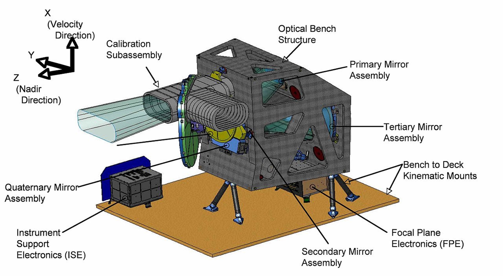

---
output:
  xaringan::moon_reader:
    lib_dir: libs
    nature:
      highlightStyle: github
      highlightLines: true
      countIncrementalSlides: false
---

class: middle
background-image:url("img/back.webp")
background-size:cover
background-position:center
 
#  Presentation of Landsat 8
## with specific focus on Operational Land Imager (OLI)
### Xiaoyun Gong

---
class: middle
background-image:url("img/overview.jpg")
background-size:cover
background-position:center

# Overview
  * Landsat 8
    * Introduction
    * Aim of Landsat 8
  * Operational Land Imager (OLI)
    * Introduction
    * New brands
    * Applications
  * Reflections
   * Summary
   * Future work

---
# What is Landsat 8?

.pull-left[
<figure>
  
  <figcaption>Fig 1: Landsat 8. <cite> Source:https://eospso.nasa.gov/ missions/landsat-8.</cite></figcaption>
</figure>

]

.pull-right[
  
* Spacecraft: Landsat 8

* Carrier rocket: Atlas -V Rocket

* Launch date: 11th February 2013

* Camera: Operational Land Imager (OLI) and the Thermal Infrared Sensor (TIRS).

* Brand: 9 short-wave bands and 2 long-wave thermal bands

* Orbit: Sun-synchronous orbit at an altitude of 705 km (438 mi) 

  ]
---
# Aim of Landsat 8
1. Medium-resolution (30-metre spatial resolution) multispectral image data are collected and archived, providing global seasonal coverage of the land area for a period of not less than five years.

1. Distribute Landsat 8 data products free of charge to the public on a non-discriminatory basis.

<video controls>
  <source src="img/Landsat8.mp4" type="video/mp4">
</video>

---
# What is Operational Land Imager (OLI)?
.pull-left[
* The Operational Land Imager (OLI) is a remote sensing instrument aboard Landsat 8, built by Ball Aerospace & Technologies.

* OLI is a push broom scanner that uses a four-mirror telescope with fixed mirrors.

* OLI operates in the visible (VIS) and short-wave infrared (SWIR) spectral regions. It has a width of 185 kilometers (115 miles), which means that it can image the entire Earth on a 16-day repeat cycle.
]

.pull-right[
<figure>

<figcaption> Fig 2: OLI instrument overview. Source:. </figcaption>
<figure>
]

---
# Something new on OLI
### New brands
The spectral and spatial resolution of the OLI channel remains the same as the previous instrument, but it adds two spectral bands (the first is the blue visible channel and the second is the infrared channel). 

These bands were designated as Band 1 and Band 9 as an enhancement to the previous instrument that lacked these channels. Band 1 was created to locate and identify water resources and to survey coastal areas, and band 9 was created for the unique purpose of detecting cirrus clouds.

---
class: middle

# Applications of OLI

.pull-left[
Assisted the Landsat-8 mission in imaging the Earth's surface and collecting medium-resolution data for applications in environmental monitoring, forest management, agriculture, land-use change, climate change and other areas of research.

The images and data collected are now publicly available and have practical applications in agriculture, mapping, and monitoring changes in fire, ice, and water.

The uses corresponding to the different band wavelengths are shown in Figure 3 on the right.
]

.pull-right[
<figure>

<figcaption> Fig 3: Table of band wavelengths and band uses. Source:https://www.usgs.gov/ science/faqs. </figcaption>
<figure>
]

---
# Reflections
### Summary
Landsat 8 is equipped with the OLI sensor, an advanced imaging tool designed for surface observation, which marks a major advance in remote sensing technology for Earth observation.

The OLI sensor offers higher image quality and accuracy than previous sensors, mainly due to its use of a fine spectral bandwidth and improved spatial resolution.

It is capable of capturing radiation from the visible to the near-infrared bands, with nine spectral bands, each optimised for the measurement of different properties and substances on the surface.
---
# Reflections
### Future work
In future work, the data provided by OLI sensors can be utilised in a number of ways.

Firstly, it can support more accurate monitoring of environmental changes, such as tracking trees and water through NDVI indices, with guaranteed good results (Ke et al. 2015). 

Secondly, urban planners can use OLI data to optimise urban layouts and improve the eco-efficiency of cities and the quality of life of their inhabitants (Bhatti and Tripathi 2014).

Finally, there is the field of disaster management . OLI data can provide critical information prior to natural disasters, such as mapping daytime and nighttime fires and monitoring fire-affected areas for more effective disaster response and recovery efforts (Schroeder et al. 2016).

---
class: center, middle
#Thank you!

<figure>

<figcaption> Fig 4: History of the Landsat program. Source:https://www.eoportal.org/satellite-missions/landsat-8-ldcm#landsat-8--ldcm-landsat-data-continuity-mission. </figcaption>
<figure>
---

# References
Bhatti, S. S. and Tripathi, N. K. (2014). ‘Built-up area extraction using Landsat 8 OLI imagery’. GIScience & Remote Sensing. Taylor & Francis, 51 (4), pp. 445–467. doi: 10.1080/15481603.2014.939539.

Ke, Y., Im, J., Lee, J., Gong, H. and Ryu, Y. (2015). ‘Characteristics of Landsat 8 OLI-derived NDVI by comparison with multiple satellite sensors and in-situ observations’. Remote Sensing of Environment, 164, pp. 298–313. doi: 10.1016/j.rse.2015.04.004.

Schroeder, W., Oliva, P., Giglio, L., Quayle, B., Lorenz, E. and Morelli, F. (2016). ‘Active fire detection using Landsat-8/OLI data’. Remote Sensing of Environment. (Landsat 8 Science Results), 185, pp. 210–220. doi: 10.1016/j.rse.2015.08.032.
